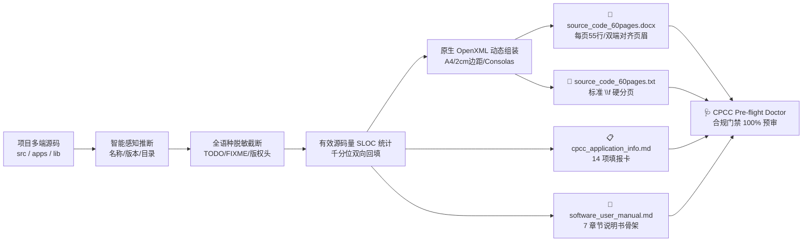

# 📜 Copyright-Kit (全自动软件著作权申报材料生成套件)

> **面向中国版权保护中心 (CPCC) 审查规范的自包含、零依赖、专业的软著材料自动化提取工具。**  
> 无论是作为 **AI Agent Skill**（智能体技能）融入日常研发对话，还是作为 **独立 CLI 命令行** 运行于本地终端与 CI/CD 流水线，均可实现 **60 秒一键交付** 100% 合规的软著申报材料包！

[](https://github.com/netxs139/copyright-kit/actions/workflows/ci.yml)
[](https://www.python.org/)
[](https://opensource.org/licenses/MIT)
[-brightgreen.svg)]()
[]()

---

## 💡 为什么需要它？

申报《计算机软件著作权登记证书》是中国境内软件发布、高企认定、企业合规以及主流应用商店（华为、小米、OPPO、vivo、App Store 等）上架提审的法定前置要件。

而传统的申报材料准备过程繁琐且极易踩坑被打回：

| 维度 | 传统手工准备痛点 | Copyright-Kit 自动化解决方案 |
| :--- | :--- | :--- |
| **源码排版** | 手动拷贝分散源码、手动调 Word 页边距与分页符，耗时数小时 | **纯标准库零依赖直出 `.docx` 原生文档**，双击打开另存即为标准 PDF |
| **行数指标** | 人工删减空行，易因每页不足 50 行被审查员直接驳回（延误 30 天） | **严格法定硬指标防护**：每页实打实 50~55 行有效代码，前 30 + 后 30 共 60 页 |
| **敏感词审查** | 代码中残留 `TODO` / `FIXME` 会被判定为“未开发完成”而拒绝登记 | **全语种智能截断脱敏**：保留代码主体，自动截断行尾 TODO 与剥离第三方商业版权头 |
| **代码量填报** | 申报表中的“源程序量”全凭主观臆测估算，与实际源码脱节 | **全项目真实 SLOC 精准统计**：全自动扫描统计并以千分位双向回填至申报表卡 |
| **主体决策** | 个人开发者盲目以自然人申报，导致后续商业 App 无法在应用商店上架 | **个人 vs 企业双轨决策树**：提供清晰对比矩阵，前置规避商业化死胡同 |
| **合规把关** | 材料递交后漫长等待，因命名或格式瑕疵收到《补正通知书》 | **内置 CPCC Pre-flight Doctor**：一键预审，递交前拦截 100% 常见形式瑕疵 |

---

## 🏗️ 处理流水线架构 (Pipeline)



---

## 🌟 核心特性 (Key Features)

- 🚀 **100% 零第三方依赖 (Zero-Dependency)**：
  - 核心引擎完全基于 Python 3.8+ 标准库（`zipfile`, `xml.sax.saxutils`, `argparse`, `pathlib`, `re`）实现；
  - **无需安装任何第三方库**（如 `python-docx` 等），全平台（Linux / macOS / Windows / 无外网沙箱环境）离线开箱即用。
- 📄 **纯标准库原生 Word (.docx) 直出**：
  - 采用轻量级原生 OpenXML 动态合成技术，一键生成符合官方规格的标准 Word 文档；
  - 内置标准 A4 页面、上下左右严格 2.0cm 页边距、Consolas 8.5pt 专用等宽代码字体；
  - 自动生成符合规范的两端对齐页眉（左侧为 `软件全称 + 版本号`，右侧为 `第 X 页`，下方横线分隔）；
  - 每页之间嵌入原生硬分页符（Page Break），直接用 Word/WPS 双击打开即可 **「另存为 PDF」** 交付！
- 📊 **全项目真实 SLOC 精确统计与自动双向回填**：
  - 自动递归扫描过滤后的全部生产代码，排除注释、空行、测试代码与构建产物，精准计算项目实际有效源码行数（SLOC）；
  - 自动检测并同步更新申报对照表 `cpcc_application_info.md` 中的 `| **源程序量** |` 字段（如 `56,783`），告别手工估算。
- 🧹 **全语种待办注释与敏感词深度截断脱敏 (Deep Sanitization)**：
  - **截断而非整行抹除**：智能识别行尾注释，保留核心有效逻辑（如 `return result # TODO: opt` 清洗为 `return result`）；
  - **全面支持主流开发语言**：
    - Python / Shell / Ruby：`# TODO`, `# FIXME`, `# XXX`
    - C / C++ / Java / Go / Rust / TypeScript / JavaScript：`// TODO`, `// FIXME`, `/* TODO ... */`
    - SQL：`-- TODO`, `/* FIXME ... */`
    - HTML / XML：`<!-- TODO ... -->`
    - CSS：`/* TODO ... */`
  - 深度剥离外源商业版权声明（如 `Copyright (c) ... Facebook/Google/MIT`），保障申报主体 100% 独立知识产权。
- 🔍 **零配置智能嗅探 (Auto-Sensing)**：
  - 自动解析项目根目录下的 `pyproject.toml`, `package.json`, `Cargo.toml`, `go.mod`, `pom.xml` 或当前目录名，智能推断合规的软件全称建议；
  - 自动探测源码目录（`src/`, `app/`, `apps/`, `lib/`, `packages/` 等），并智能跳过 `.git`, `node_modules`, `.venv`, `dist`, `target`, `test`, `tests`, `docs` 等无关目录。
- 🩺 **CPCC Pre-flight Doctor 前置门禁**：
  - 内置全自动扫描器，前置严格审查全称法定后缀、大写 V 版本号、60 页/50+行硬指标、敏感词零容忍度以及说明书结构完备性。

---

## ⚖️ 申报主体选择决策指南 (个人 vs 企业)

在正式申报前，请根据商业化规划决策申报主体性质：

| 决策维度 | 选项 A：【个人（自然人）】申报 | 选项 B：【公司（企业法人）】申报 (推荐用于商用App) |
| :--- | :--- | :--- |
| **所需资质** | 仅需**个人身份证正反面彩色扫描件** | 需**营业执照副本彩色扫描件**、**企业公章**、法人身份证 |
| **签章流程** | **免公章**，申请表签章页仅需个人手写签字 | 申请表签章页必须**加盖公章并由法人签字** |
| **应用市场上架** | **严重受限 ❌**（华为/小米/OPPO等各大应用商店均已限制个人开发者提交收支/记账/工具类App） | **一路绿灯 ✔**（企业开发者账号上架无阻碍，软著权属与上架主体一致） |
| **资产与高企** | 属于个人私产；如需注入公司需走繁琐的软著转让变更（耗时1~2个月） | 计入公司无形资产，可直接用于高新技术企业认定与税收优惠 |
| **保护期限** | 作者终生及死后 50 年 | 软件开发完成之日起 50 年 |

---

## 📦 目录结构 (Self-Contained Architecture)

```text
copyright-kit/
├── .github/workflows/ci.yml          # GitHub Actions 跨平台持续集成
├── SKILL.md                          # AI Agent 自动化申报技能规约 (供智能体读取)
├── README.md                         # 开发者手册与命令行指南 (本文档)
├── LICENSE                           # MIT 开源许可证
├── pyproject.toml                    # 标准 PEP 621 打包配置与 CLI 入口声明
├── scripts/                          # 核心脚本引擎 (纯标准库，零依赖)
│   ├── export_copyright_source.py   # 60 页源程序规范提取、脱敏、排版与 docx 生成引擎
│   └── audit_copyright_package.py   # CPCC 合规门禁 Pre-flight Doctor 扫描器
├── templates/                        # 官方申报标准化模板
│   ├── cpcc_form_fields.md          # 14 项官方全字段填报对照卡模板
│   └── user_manual_template.md      # 7 大标准章节《用户操作说明书》图文骨架
└── tests/
    └── test_copyright_kit.py        # 8 项自包含自动化单元测试
```

---

## 🛠️ 安装与使用方式 (Installation & Setup)

### 方式一：使用 uvx / pipx 免安装一键运行 (极速推荐)

如果您安装了 `uv` 或 `pipx`，无需克隆代码即可在任何目标项目下秒级运行：

```bash
# 使用 uvx 运行 (推荐)
uvx --from git+https://github.com/netxs139/copyright-kit.git copyright-kit

# 门禁审计
uvx --from git+https://github.com/netxs139/copyright-kit.git audit-copyright --dir docs/copyright
```

### 方式二：作为 AI Agent 技能接入

支持将本套件作为 Skill 挂载至任何具备智能体能力的 IDE 或命令行工具（如 Claude Code, Antigravity IDE, Cursor, Windsurf, Codex 等）：

- **项目级（推荐）**：放置在您待申报项目的 `.agents/skills/copyright-kit`
- **全局级**：放置在各 IDE 默认的全局技能根目录（如 `~/.gemini/antigravity-ide/skills/copyright-kit`）

挂载后，直接在对话框中向 AI 助手输入：
> *“帮我准备这个项目的软件著作权材料”* 或输入 */copyright-kit*  
> AI 将自动激活引导流水线：从申报主体选择、元数据确认，到一键抽取排版、说明书骨架填充与门禁复查。

### 方式三：作为独立 CLI 命令行使用 (克隆即用)

```bash
git clone https://github.com/netxs139/copyright-kit.git
```

---

## 🚀 命令行快速上手 (CLI Quick Start)

### 步骤 1：一键抽取 60 页合规源程序 (同时输出 .docx 与 .txt)

进入待申报项目的根目录下，直接调用抽取脚本：

#### 方案 A：零配置极简模式 (自动嗅探应用名与源码目录)
```bash
python3 /path/to/copyright-kit/scripts/export_copyright_source.py
```

#### 方案 B：精确指定参数模式
```bash
python3 /path/to/copyright-kit/scripts/export_copyright_source.py \
  --src-dir src/ apps/ \
  --app-name "某某数字化协同管理软件" \
  --version "V1.0" \
  --lines-per-page 55 \
  --pages 60
```

**命令行参数详尽说明**：
| 参数名 | 默认值 | 作用说明 |
| :--- | :--- | :--- |
| `--src-dir` | *自动嗅探* | 源码搜索目录，支持指定多个（如 `--src-dir src/ packages/`） |
| `--app-name` | *自动推断* | 软件全称，必须以“软件/系统/平台/工具/中间件”等法定名词结尾 |
| `--version` | `V1.0` | 软件版本号，必须以大写英文字母 `V` 开头 |
| `--output-file`| `docs/copyright/source_code_60pages.txt` | 纯文本产物输出路径（同目录下会自动伴生生成同名 `.docx`） |
| `--lines-per-page` | `55` | 每页代码行数（CPCC 法定要求每页 $\ge 50$ 行） |
| `--pages` | `60` | 提取总页数（前 30 页 + 后 30 页） |
| `--exts` | 常见源码后缀 | 允许抓取的文件扩展名（如 `.py,.ts,.vue,.go,.rs,.java`） |
| `--exclude` | 常见测试/依赖目录 | 额外排除的目录名称（逗号分隔） |

**控制台实际输出示例**：
```text
====================================================================
📄 正在抽取软件著作权源程序文档: 某某数字化协同管理软件 V1.0
   扫描目录: /workspace/my-project/src
   目标规格: 每页 55 行，共 60 页 (前 30 + 后 30)
====================================================================
🔍 扫描到清洗后有效代码行数: 48,260 行
✅ 成功导出标准软著源程序文档: docs/copyright/source_code_60pages.txt
   总格式化行数: 3539 行 (包含页眉与分隔线)
📄 成功导出原生 Word 排版文档: docs/copyright/source_code_60pages.docx (内置 A4 / 2cm 边距 / Consolas 等宽字体)
📊 已将真实源程序量 (48,260 行) 自动同步至申报填报卡: docs/copyright/cpcc_application_info.md
====================================================================
```

---

### 步骤 2：运行 CPCC 合规门禁审查 (Pre-flight Doctor)

在正式向中国版权保护中心提交前，运行静态门禁扫描器：

```bash
python3 /path/to/copyright-kit/scripts/audit_copyright_package.py \
  --dir docs/copyright \
  --app-name "某某数字化协同管理软件" \
  --version "V1.0"
```

**审计结果**：
```text
====================================================================
🛡️ 正在执行软件著作权申报材料合规门禁审计 (CPCC Pre-flight Doctor)
   目标目录: .../docs/copyright
====================================================================
✅ [1/4] 软件全称与版本命名合规: '某某数字化协同管理软件 V1.0'
✅ [2/4] 60 页源程序文档规格、行数与敏感词零容忍 100% 达标！
✅ [3/4] 软件使用说明书大纲与核心章节就绪
✅ [4/4] CPCC 在线申请表填报字段卡就绪
====================================================================
🎉 恭喜！软著全套申报材料 100% 通过合规门禁，符合中国版权保护中心审查规范！
====================================================================
```

---

## 📑 官方申报材料准备与提交指引

执行完上述步骤后，您的 `docs/copyright/` 目录下将具备完整的申报资产包：

### 1. 源程序文档 (`source_code_60pages.docx` / `.txt`) $\rightarrow$ 另存为 PDF
- **推荐方案 (秒速直出)**：系统已自动生成精美排版的原生 Word 文件 `source_code_60pages.docx`。内置 A4 纸张、2.0cm 边距、Consolas 等宽代码字体、两端对齐页眉与每页 55 行硬分页。用 Word 或 WPS 双击打开后，直接点击 **「文件 $\rightarrow$ 另存为 PDF」** 即可！
- **备用方案 (纯文本)**：若使用纯文本文件 `source_code_60pages.txt`，可全选粘贴至新建 Word，设置等宽字体小四号/9pt 与单倍行距，利用文档内嵌的标准分页符 `\f` 自动分页后导出为 PDF。

### 2. 软件使用说明书 (`software_user_manual.md`) $\rightarrow$ 截图配图转 PDF
- 参考模板生成的 7 大标准章节（系统概述、安装隐私、核心业务、辅助功能、安全注销与著作权人声明）；
- 替换或插入 5~8 张软件实际运行的真实高清截图；
- **审查避坑要点**：
  - 截图必须真实自然，如为移动端 App 建议保留手机顶部状态栏与电量/时间显示；
  - 界面中绝对**严禁出现“测试”、“DEMO”、“Beta”** 等字样；
  - 导出为 PDF（建议控制在 15~25 页）。

### 3. 在线申请表填报 (`cpcc_application_info.md`)
- 登录 [中国版权保护中心微平台](https://register.ccopyright.com.cn/)；
- 对照填报卡中的 14 项字段逐项复制填入（主要功能字数已严格控制在 200 字以内，源程序量已自动按真实代码行数同步）；
- 上传源码 PDF 与说明书 PDF，下载系统自动生成的《软件著作权登记申请表》；
- 打印申请表签章页：由个人签字（自然人申报）或法定代表人签字加盖公章（企业申报），回传扫描件即可完成提交！

---

## 💡 官方审查核心避坑指南 (Official CPCC Guardrails)

1. **全称法定命名规范**：
   - 软件全称必须以法定名词结尾，常见合法后缀为：`软件`、`系统`、`平台`、`工具`、`中间件`、`套件`、`引擎`；
   - 严禁裸英文名称（例如：申报全称直接写 `MyTool` 会被审查员无条件驳回，必须规范命名为 `某某项目数据管理软件` 或 `MyTool协同办公系统`）。
2. **版本号严格大写 V 开头**：
   - 必须为大写字母 `V` 开头（如 `V1.0` 或 `V1.0.0`），严禁写成 `v1.0` 或直接写 `1.0`。
3. **申报主体决策关键权衡**：
   - **企业法人申报 (推荐用于商业 App)**：需营业执照与公章。各大手机厂商应用商店（华为、小米、OPPO、vivo 等）已全面要求工具及收支类 App 必须具备企业软著与企业开发者账号，以企业主体申报一路绿灯；
   - **自然人申报 (适合纯个人自用/开源项目)**：仅需身份证正反面彩色扫描件，全程免公章，申请表手写签字即可。
4. **全套材料 100% 字符串一致性法则**：
   - 申请表、源码页眉、说明书封面标题中的软件全称与版本号必须 **逐字逐标点 100% 一致**，任何空格差异均会触发补正。

---

## 🧪 自动化测试与验证

套件内置自包含轻量级自动化测试套件，克隆本仓库后即可直接验证：

```bash
pytest tests/test_copyright_kit.py -v
```

---

## 📄 开源许可证 (License)

本项目遵循 [MIT License](LICENSE) 开源协议。欢迎提交 PR 与 Issue！
