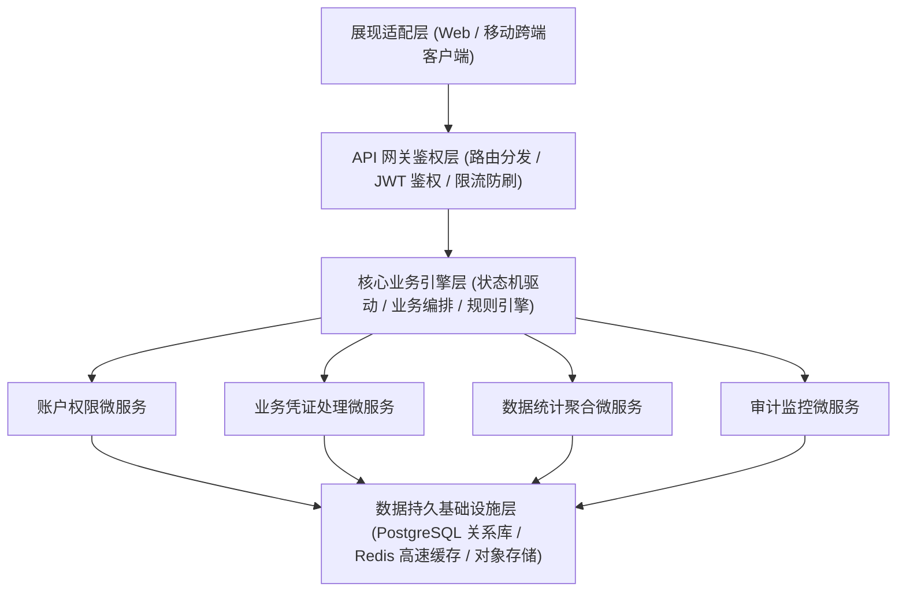
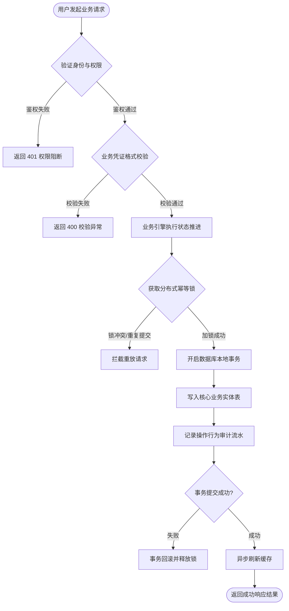
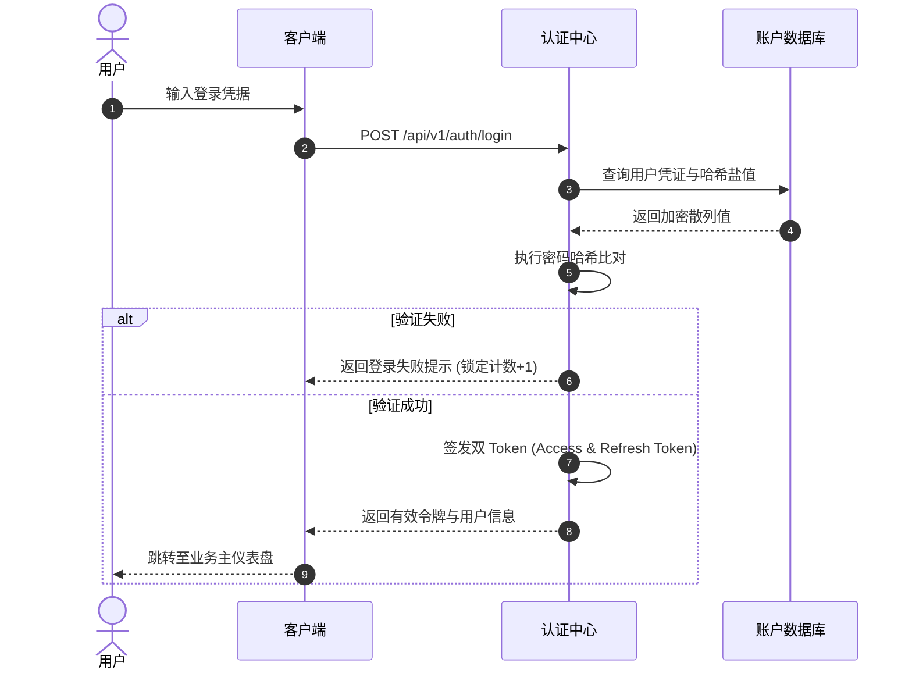
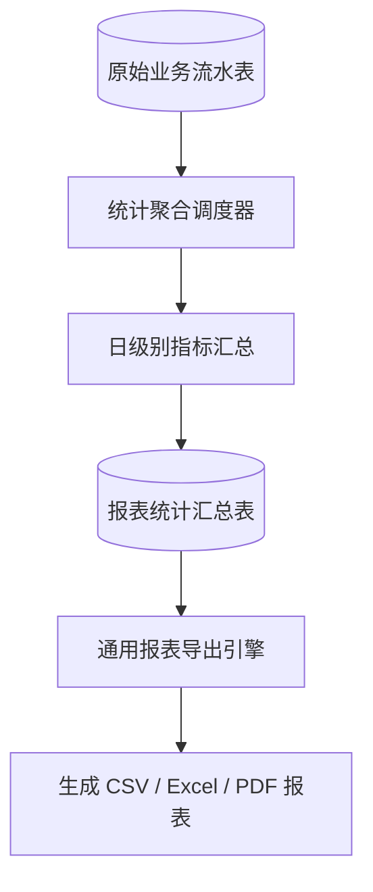

# {{FULL_NAME}} 详细设计说明书

> **软件全称**：{{FULL_NAME}}  
> **软件简称**：{{SHORT_NAME}}  
> **版本号**：{{VERSION}}  
> **著作权人**：{{COMPANY_NAME}}  
> **文档密级**：内部技术材料  
> **编写日期**：{{DATE}}  
> **版次状态**：V1.0 正式发布版  

---

## 目录
- **第一章 系统概述与设计目标**
  - 1.1 研发背景与系统定位
  - 1.2 系统设计原则与质量指标
  - 1.3 软硬件运行支撑环境
- **第二章 总体技术架构设计**
  - 2.1 整体分层技术架构图
  - 2.2 数据持久化与缓存架构
  - 2.3 网络拓扑与安全通信边界
- **第三章 全局核心业务流程设计**
  - 3.1 软件主业务流转总流程图
  - 3.2 异常拦截与状态容错机制
- **第四章 核心功能模块详细设计**
  - 4.1 身份认证与权限控制模块设计
  - 4.2 核心业务流推进与凭证处理模块设计
  - 4.3 多维数据统计与报表导出模块设计
  - 4.4 系统监控与行为审计日志模块设计
  - 4.5 系统配置与生命周期治理模块设计
- **第五章 接口契约与数据模型规范**
  - 5.1 核心数据实体关系设计
  - 5.2 API 契约与传输规范
- **第六章 系统可靠性与安全设计**
  - 6.1 数据加密与敏感信息防护
  - 6.2 异常恢复与幂等性保障
- **附录：著作权与知识产权声明**

---

## 第一章 系统概述与设计目标

### 1.1 研发背景与系统定位
《{{FULL_NAME}}》是针对现代业务数字化协同与资产管理需求自主研制的高性能专业应用系统。系统旨在消除传统人工核验或离线处理模式中的效率瓶颈与数据孤岛，提供端到端的数据全生命周期沉淀、结构化治理与可视化展示能力。

### 1.2 系统设计原则与质量指标
1. **高内聚低耦合**：各微服务/子模块严格面向契约编程，核心业务逻辑与网络/展现层分离；
2. **确定性与强类型契约**：全链路采用强类型 Schema 定义出入参，防范动态类型断裂与隐式数据污染；
3. **数据一致性与幂等安全**：关键操作设计严格状态变迁路径与重放免疫机制；
4. **性能基线指标**：常规业务查询响应时间 $\le 150$ms，在高并发环境下保障 99.9% 以上服务可用性。

### 1.3 软硬件运行支撑环境
- **开发操作系统**：macOS Sequoia / Ubuntu 22.04 LTS / Windows 11；
- **开发工作站配置**：8核 CPU 以上，16GB 内存以上，512GB SSD；
- **部署与运行环境**：云端 Linux 服务器 (Ubuntu/Debian) 或主流移动智能终端；
- **基础支撑技术栈**：Python 3.12+, Node.js 20+, PostgreSQL 16+, Redis 7+。

---

## 第二章 总体技术架构设计

### 2.1 整体分层技术架构图
系统采用四层分层架构体系设计，自顶向下涵盖展现适配层、API 网关鉴权层、核心业务引擎层与底层持久基础设施层：



### 2.2 数据持久化与缓存架构
- **持久数据库 (PostgreSQL 16+)**：承载核心业务实体表、凭证记录表与审计流水，采用强外键约束与两级命名空间隔离；
- **分布式高速缓存 (Redis 7+)**：用于缓存高频只读会话令牌、热点业务配置与防重放单飞锁，大幅卸载数据库并发读压力。

### 2.3 网络拓扑与安全通信边界
系统所有外部客户端请求必须通过反向代理网关接入，强制启用 TLS 1.3 (HTTPS) 通信，内部微服务通信采用物理隔离的内网网卡，杜绝未鉴权流量直接穿透数据库。

---

## 第三章 全局核心业务流程设计

### 3.1 软件主业务流转总流程图
系统核心业务从用户身份鉴权、凭证数据录入、状态推进校验到最终持久化归档的端到端全局主流程如下：



### 3.2 异常拦截与状态容错机制
1. **全局统一异常谱系**：所有错误均包装为结构化状态码与业务错误码，严禁向前端泄漏后端原始堆栈信息；
2. **幂等性保障**：核心更新接口内置客户端请求唯一 ID 校验，同一操作 5 秒内重放直接返回上次处理结果。

---

## 第四章 核心功能模块详细设计

### 4.1 身份认证与权限控制模块设计
负责系统用户生命周期管理与细粒度访问控制。用户登录流程图如下：



### 4.2 核心业务流推进与凭证处理模块设计
负责核心业务实体的创建、状态变迁核验与生命周期推进。模块流程图如下：

```mermaid
flowchart LR
    Draft[草稿态 (Draft)] -->|提交审核| InReview[审核中 (Pending)]
    InReview -->|审核通过| Active[生效态 (Active)]
    InReview -->|驳回修正| Rejected[已驳回 (Rejected)]
    Rejected -->|重新编辑提交| InReview
    Active -->|归档注销| Archived[已归档 (Archived)]
```

### 4.3 多维数据统计与报表导出模块设计
通过聚合管道定时汇总原始流水记录，支持按日、周、月维度生成统计报表。数据流管道图如下：



### 4.4 系统监控与行为审计日志模块设计
内置异步审计事件收集拦截器，记录所有涉及增删改的高危操作行为，审计数据包含：操作人、时间戳、源 IP、操作动作、变更前后快照数据。

### 4.5 系统配置与生命周期治理模块设计
支持系统级运行参数动态调优，同时提供符合个人信息保护法的账户注销与数据物理脱敏擦除通道。

---

## 第五章 接口契约与数据模型规范

### 5.1 核心数据实体关系设计
核心实体遵循严格的规范化设计，实体关系（ER）概述如下：
- `sys_user`：系统账户表，维护用户基础凭证与安全状态；
- `sys_role` / `sys_user_role`：角色与权限映射表；
- `biz_record`：核心业务主体表，记录核心业务属性与当前状态；
- `biz_audit_log`：业务操作审计流水表，记录所有业务实体变迁历史。

### 5.2 API 契约与传输规范
所有接口统一采用 JSON 传输契约，标准响应报文骨架如下：
```json
{
  "code": 200,
  "message": "success",
  "data": { ... },
  "timestamp": 1774000000000
}
```

---

## 第六章 系统可靠性与安全设计

### 6.1 数据加密与敏感信息防护
1. **传输安全**：强制启用全链路 TLS 1.3 传输加密；
2. **凭据安全**：用户密码采用 Argon2id / PBKDF2 强散列单向加密，严禁明文落地；
3. **敏感信息脱敏**：手机号、身份证等核心敏感隐私在前端展现与日志输出时统一进行掩码脱敏处理。

### 6.2 异常恢复与幂等性保障
- 数据库操作强制采用事务管理，出现异常自动无损回滚；
- 容器编排层配置多副本与自动健康探测（Liveness / Readiness Probe），故障秒级隔离自愈。

---

## 附录：著作权与知识产权声明

本软件《{{FULL_NAME}}》所包含之全部系统架构、流程图设计、核心算法实现、数据库建模及源程序代码之全部著作权均归属于**{{COMPANY_NAME}}**所有。受《中华人民共和国著作权法》、《计算机软件保护条例》及国际版权条约之严格保护。
